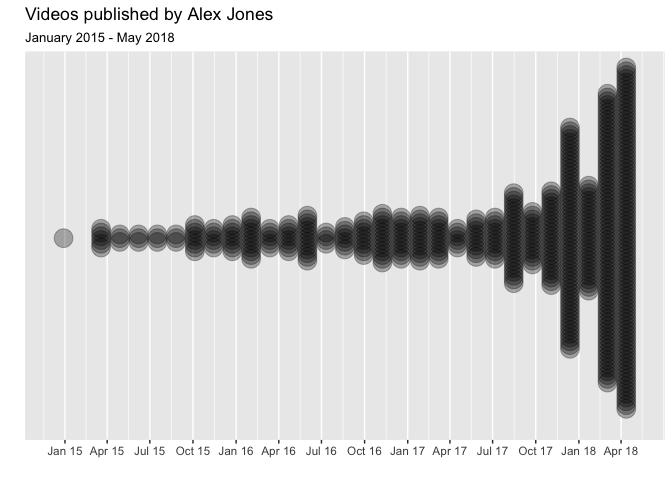
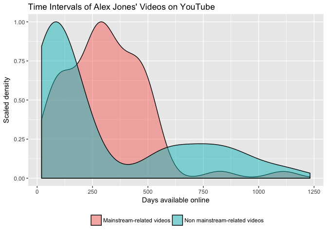
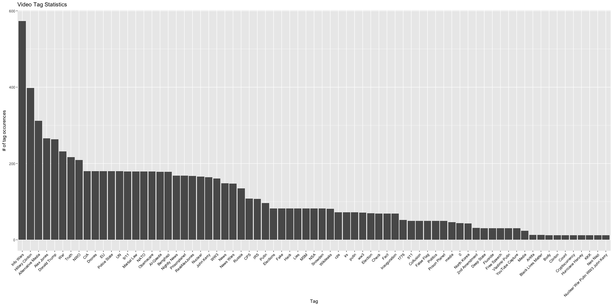
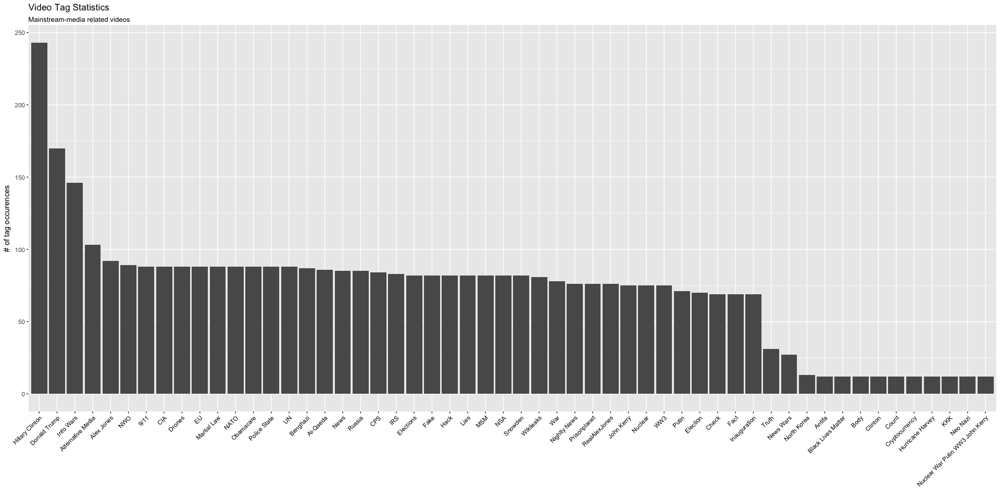
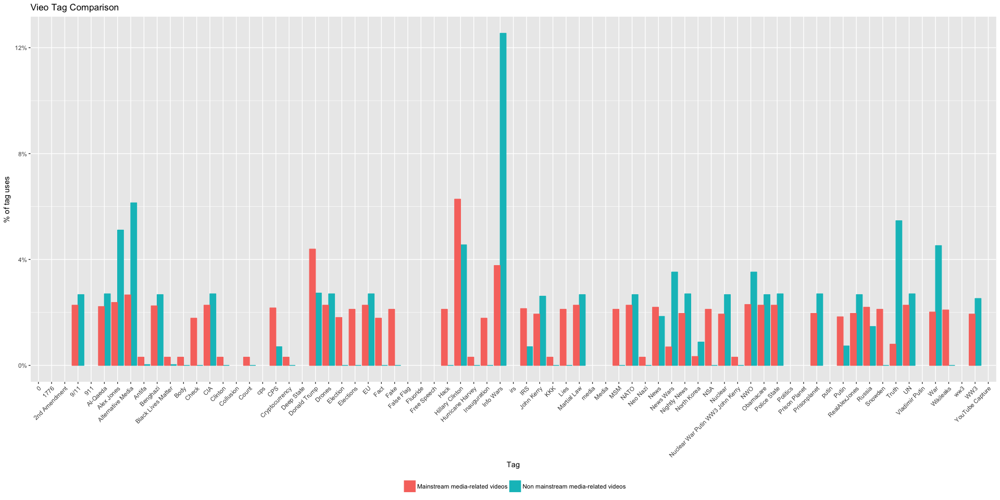
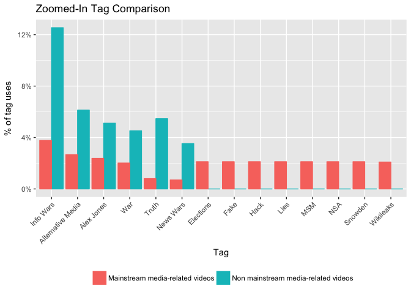
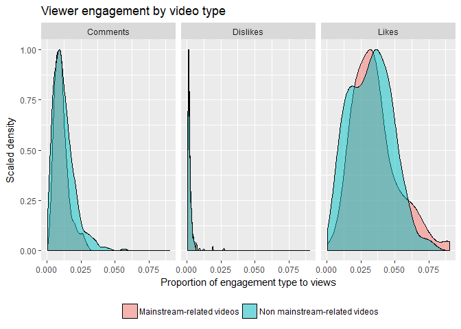

Mainstream Media Discourse by Far Right Influences on YouTube
================
Hope Johnson <br>
May 2018

``` r
library(tidyverse)
library(jsonlite)
library(stringr)
library(lubridate)
library(magrittr)
library(skimr)
library(memisc)
```

Introduction
============

This work was created to support the Media Manipulation Initiative (MMI) at Data & Society. The goal of the the Media Manipulation Initiative is to examine how different groups use the participatory culture of the internet to turn the strengths of a free society into vulnerabilities, ultimately threatening expressive freedoms and civil rights. For this task, researchers at the Media Manipulation Initiative are interested in how YouTube influences are attacking the mainstream media. One of the most active influencers is Alex Jones and his media network InfoWars. By taking a deep dive into Alex Jones' YouTube videos, the research team will learn how discourse related to the mainstream media differs from other content uploaded by Alex Jones.

My job is to explore video data from Alex Jones' YouTube account. I extract information from the video data, sorting the videos into two groups: (1) videos related to the mainstream media, and (2) videos related to other topics (i.e. technology, foreign affairs conspiracies, etc.). By summarizing, visualizing, and analyzing the video data, I glean what makes a video related to the mainstream media unique.

What follows is the data-generating, cleaning and analytical process for a slice of content uploaded to the Alex Jones Channel (between January 1st, 2015 and May 4th, 2018). The data for this task was scraped using Google's Youtube Data API. The code to extract such data lives in `get-dat.py`, available in the code folder. The extracting function in `get-dat.py` would be useful to extract future data from the YouTube API. Other developers are welcome to utilize this code as a way to make YouTube video data more accessible for their research.

I find that Alex Jones' videos related to the mainstream media garner more attention from viewers than videos unrelated to the mainstream media. They are also more often associated with conspiratorial tags such as "fake", "lies", and "hacked". These findings supply reproducible, quantitative evidence in support of past research conducted at Data & Society.

In the first section on scraping and cleaning data, I provide a dispatch for how to recognize videos nominally concerning other topics, but that actually relate to the mainstream media based on video tags and description. In the next section, I direct attention to the political and social crises reflected in the data with my focus on the temporality of the mainstream media-related videos. In the final section, I perform a statistical analysis of the impact of mainstream media-related content on viewer engagement. I conclude with a discussion of results and areas for future data work.

Scrape and Clean YouTube Data
=============================

From the YouTube API, I scrape the title, description, tags, number of likes, number of dislikes, and number of views for each video uploaded to the Alex Jones YouTube channel during the specified three-year time period. The video statistics data arrives as a .json file, which for a single video appears like the chunk below.

``` r
 {
        "etag": "\"DuHzAJ-eQIiCIp7p4ldoVcVAOeY/3xbKWLXhghfFL-E8ShUKH9FmQkI\"",
        "items": [
            {
                "etag": "\"DuHzAJ-eQIiCIp7p4ldoVcVAOeY/JEIv93BVt7HnVH5wreobXMimZJs\"",
                "id": "JEkS5w3NegA",
                "kind": "youtube#video",
                "snippet": {
                    "categoryId": "25",
                    "channelId": "UCvsye7V9psc-APX6wV1twLg",
                    "channelTitle": "The Alex Jones Channel",
                    "defaultAudioLanguage": "en",
                    "description": "Dr. Ed Group joins Alex Jones live in studio to expose how 5G cell phone radiation is poisoning the population by microwaving our cells/DNA to prevent people from reproducing the human species.",
                    "liveBroadcastContent": "none",
                    "publishedAt": "2018-05-03T21:55:03.000Z",
                    "tags": [
                        "Infowars",
                        "Alex Jones",
                        "Donald Trump",
                        "Politics",
                        "Prison Planet",
                        "1776",
                        "False Flag",
                        "911",
                        "Russia",
                        "Collusion",
                        "News",
                        "War",
                        "WW3"
                    ],
                    "title": "BREAKING: Government Admits 5G Is Killing You And Your Family"
                },
                "statistics": {
                    "commentCount": "320",
                    "dislikeCount": "38",
                    "favoriteCount": "0",
                    "likeCount": "783",
                    "viewCount": "20182"
                }
            }
        ],
        "kind": "youtube#videoListResponse",
        "pageInfo": {
            "resultsPerPage": 1,
            "totalResults": 1
        }
    }
```

JSON stands for JavaScript Object Notation, and this file format is commonly used to store data on the web. For data analysis and visualization, JSON is not ideal. As an initial step, I write a number of helper functions to convert a nested list item into a dataframe. I want to build up a [tidy](https://cran.r-project.org/web/packages/tidyr/vignettes/tidy-data.html) dataframe, where each variable has its own column and each video has its own row.

If the code below means nothing to you, don't worry. I'm mostly keeping these helper functions around in order to remember what I did later on. The main takeaway is that data munging gets us from the nested, concave format shown above to a rectangular, tidy one for easy analysis.

``` r
# For more on .json file flattening, see:
# https://stackoverflow.com/questions/35444968/read-json-file-into-a-data-frame-without-nested-lists

col_fixer <- function(x, vec2col = FALSE) {
  if (!is.list(x[[1]])) {
    if (isTRUE(vec2col)) {
      as.data.table(data.table::transpose(x))
    } else {
      vapply(x, toString, character(1L))
    }
  } else {
    temp <- rbindlist(x, use.names = TRUE, fill = TRUE, idcol = TRUE)
    temp[, .time := sequence(.N), by = .id]
    value_vars <- setdiff(names(temp), c(".id", ".time"))
    dcast(temp, .id ~ .time, value.var = value_vars)[, .id := NULL]
  }
}

Flattener <- function(indf, vec2col = FALSE) {
  require(data.table)
  require(jsonlite)
  indf <- flatten(indf)
  listcolumns <- sapply(indf, is.list)
  newcols <- do.call(cbind, lapply(indf[listcolumns], col_fixer, vec2col))
  indf[listcolumns] <- list(NULL)
  cbind(indf, newcols)
}

#' @return flattened video item with a column for each nested piece of information from json
make_tidy <- function(item){
  colNames <- c("categoryId", "channelId", "channelTitle", "defaultAudioLanguage", "description",
                "liveBroadcastContent", "localized", "tags", "publishedAt", "thumbnails", "title") # only keep columns I care about
  item <- data.frame(item)
  { if (length(colNames) != length(names(item$snippet))) {
      missingCols <- setdiff(union(names(item$snippet), colNames), intersect(names(item$snippet), colNames))
      item$snippet[, missingCols] <- ""   
      if ("tags" %in% missingCols) {item$snippet$tags <- list(0)}
      item$snippet <- item$snippet[colNames]  
      item$snippet[ ,order(names(item$snippet))]
      }  
  }
  Flattener(item) %>%
  as_data_frame()
}

#' @return clean, flat dataframe from .json file where each unique video is a row
clean_full_dat <- function(file){
  df <- fromJSON(file) %>%
  pull(items) %>%
  map_dfr(make_tidy) %>%
  select(-(contains("thumbnails"))) %>%
  rename_(.dots = setNames(names(.),
                           gsub("snippet.","", names(.)))) %>%
  rename_(.dots = setNames(names(.), gsub("statistics.","", names(.)))) %>%
  mutate_at(vars(contains("Count")), funs(as.numeric)) %>%
  mutate(publishedAt = ymd_hms(publishedAt),
         year = year(publishedAt)) %>%
    # the etag has something to do with the video being updated (possibly, edited)
    select(-etag) %>%
    # keep the video observation with the highest viewCount (likely the most up-to-date)
    arrange(id, desc(viewCount)) %>%
    group_by(id) %>%
    filter(row_number() == 1) %>%
    ungroup()
  return(df)
}
```

GitHub doesn't like it when users store data within a repository. If you would like the raw .json or tidy data rather than running the code provided, please get in touch with me via email.

``` r
full_dat <- clean_full_dat("../data/vid_details.json")
#write_rds(full_dat, "data/video_metadata.rds") # .rds for type persistence
```

`full_dat` contains video titles, viewer statistics, and other details for all the videos uploaded to the Alex Jones channel between between January 1st, 2015 and May 4th, 2018. Each row in the dataset represents a single video, and we observe 506 videos in total. Each video has 19 variables of interest (i.e. features, covariates, or inputs) associated with it.

Filter to media manipulation-related videos
-------------------------------------------

The research team is interested in gathering insights from (1) the full collection of videos, and (2) a subset of videos with tags identified as relevant to discourse against mainstream media.

To create a dataset with only the words identified by researchers as relevant, I perform a search of the following attributes of each video: tags, description, and title. If any of the relevant terms show up in any of those three items, I save the video to a secondary dataframe, `ms_dat`. Note that any escape characters attached to relevant\_terms (e.g., "buzzfeed/n", indicating a new paragraph) will still be found in the search function.

``` r
relevant_terms <- c("Mainstream media",
              "MSM",
              "CNN",
              "Mtv",
              "buzzfeed",
              "Nytimes",
              "ny times",
              "New york times",
              "Wapo",
              "Washington post",
              "Msnbc",
              "Lamestream",
              "propaganda")
pattern <- paste0(relevant_terms, collapse = "|")

mainstream_filter <- function(data, feature) {
  select <- str_detect(data[[feature]], regex(paste0("(?i)", pattern)))
  data <- data[select, ]
  return(data)
}

subset_by_tags <- mainstream_filter(full_dat, "tags")
subset_by_description <- mainstream_filter(full_dat, "description")
subset_by_title <- mainstream_filter(full_dat, "title")

ms_dat <- subset_by_description %>%
  bind_rows(subset_by_tags) %>%
  bind_rows(subset_by_title) %>%
  distinct()
#write.csv(ms_dat, "data/video_metadata_mainstream_media.csv")
```

Exploration and Analysis
========================

I poke around with variables of interest from both the full dataset and the data filtered down to only those videos related to the mainstream media. I aim to draw out what differentiates a video related to the mainstream media from the others in the dataset. Specially, I want to uncover if a video related to the mainstream media was on average more popular, more commented on, and/or assigned a greater number of tags than a video unrelated to the mainstream media.

Summary statistics
------------------

Below are summary statistics for numeric variables of the full dataset.

Skim summary statistics
n obs: 506
n variables: 19

Variable type: integer

|   variable   | missing | complete |  n  |    mean   |     sd    |  p0  |    p25   |  p50  |    p75   |   p100  |   hist   |
|:------------:|:-------:|:--------:|:---:|:---------:|:---------:|:----:|:--------:|:-----:|:--------:|:-------:|:--------:|
| commentCount |    0    |    506   | 506 |  1993.57  |  5781.52  |  19  |   315.5  |  610  |   1622   |  92533  | ▇▁▁▁▁▁▁▁ |
| dislikeCount |    0    |    506   | 506 |   638.5   |   3189.8  |   4  |    37    |  89.5 |  291.25  |  57228  | ▇▁▁▁▁▁▁▁ |
|   likeCount  |    0    |    506   | 506 |  4508.17  |  8716.95  |  107 |   885.5  |  1913 |   4930   |  122859 | ▇▁▁▁▁▁▁▁ |
|   viewCount  |    0    |    506   | 506 | 226621.85 | 526681.42 | 4518 | 24896.25 | 55635 | 177095.5 | 6756754 | ▇▁▁▁▁▁▁▁ |
|     year     |    0    |    506   | 506 |  2017.09  |    0.92   | 2015 |  2016.25 |  2017 |   2018   |   2018  | ▁▁▃▁▁▇▁▇ |

In contrast, the table below provides summary statistics for videos with **mainstream-media tags**.

Skim summary statistics
n obs: 125
n variables: 20

Variable type: integer

|   variable   | missing | complete |  n  |   mean  |     sd    |  p0  |  p25  |  p50  |   p75  |  p100 |   hist   |
|:------------:|:-------:|:--------:|:---:|:-------:|:---------:|:----:|:-----:|:-----:|:------:|:-----:|:--------:|
| commentCount |    0    |    125   | 125 |  1563.2 |   2502.8  |  19  |  317  |  689  |  2084  | 20858 | ▇▁▁▁▁▁▁▁ |
| dislikeCount |    0    |    125   | 125 |  844.89 |  5165.73  |   4  |   38  |   97  |   342  | 57228 | ▇▁▁▁▁▁▁▁ |
|   likeCount  |    0    |    125   | 125 | 4854.27 |  6418.85  |  130 |  969  |  1944 |  6827  | 39234 | ▇▂▁▁▁▁▁▁ |
|   viewCount  |    0    |    125   | 125 |  2e+05  | 383485.94 | 4518 | 26729 | 56265 | 228781 | 3e+06 | ▇▁▁▁▁▁▁▁ |
|     year     |    0    |    125   | 125 | 2017.07 |    0.6    | 2015 |  2017 |  2017 |  2017  |  2018 | ▁▁▁▁▁▇▁▂ |

When I compare the two tables, I immediately notice a few things:

1.  The average number of dislikes on the videos in our mainstream subset is higher than the average for all videos. The average number of dislikes in the mainstream subset is 845, whereas the average number of dislikes for all videos is 639. That said, the standard deviation is also much greater for the mainstream subset than for the full dataset. This means that the number of likes are less tightly clustered around the mean for the videos in the mainstream subset relative to the full dataset.
2.  The same is true for number of likes, despite the fact that the average number of views for the videos in the mainstream subset is lower than for the overall videos. The average number of likes for the videos in the mainstream subset is 4854, whereas the average number of likes for all videos is 4508.
3.  The median date published for the full dataset is December 4th, 2017. The median date published for the mainstream subset is August 10th, 2017. This suggests that the temporal pattern of videos differs between the two datasets. I'll explore this point first in the section below.

Date Published
--------------

Although the publication date for the video data spans from the beginning of 2015 and mid-2018, the median video date is December 4th, 2017. This suggests that Alex Jones increased his rate of video publication over time. The plot below shows videos published over time, where each dot represents a single video uploaded.

``` r
break.vec<-c(seq(from=as.Date("2015-01-08"), to=as.Date("2018-05-03"), by = "3 month"))

ggplot(full_dat, aes(as.Date(publishedAt))) + 
 geom_dotplot(stackdir = "center", stackratio = .2, alpha = .3,
              method = "histodot", binwidth = 40) + 
 scale_x_date(date_labels = "%b %y",
              breaks = break.vec) +
 scale_y_continuous(breaks = NULL) + 
 labs(x = "",  y = "", title = "Videos published by Alex Jones",
      subtitle = "January 2015 - May 2018")
```



Are videos related to the mainstream media published closer to the end of the period of interest? Do they surround the 2016 presidential election?

To answer this question, I append the working dataset with a number of useful variables for future use. Most helpful of all is a binary indicator of whether or not each individual video is related to the mainstream media or not. Upon doing so, I re-create the graph above but with each video classified as pink or blue. Pink indicates that a video is related to the mainstream media based on keyterms in its description, title, or tags. Blue indicates that a video is unrelated to the mainstream media based on the same criteria.

``` r
cat_full_dat <- full_dat %>%
  mutate(main_stream_desc = ifelse(is.na(description), FALSE, str_detect(description, regex(paste0("(?i)", pattern)))),
         main_stream_title = str_detect(title, regex(paste0("(?i)", pattern))),
         main_stream_tags = str_detect(tags, regex(paste0("(?i)", pattern)))) %>%
  mutate(main_stream = ifelse((main_stream_desc | main_stream_tags | main_stream_title), "Mainstream-related videos", "Non mainstream-related videos"),
         ms = ifelse(main_stream == "Mainstream-related videos", 1, 0), 
         Likes = likeCount/viewCount,
         Dislikes = dislikeCount/viewCount,
         Comments = commentCount/viewCount,
         nTags = str_count(tags, ",") + 1, # number of tags: number of commas + 1
         friendlyPublished = parse_date_time(publishedAt, orders = "Ymd HMS"),
         datePulled = parse_date_time("2018-05-24", orders = "Ymd"),         # HCJ scrape date
         time_available = (datePulled - friendlyPublished), units = "days") 

ggplot(cat_full_dat, aes(as.Date(publishedAt), color = main_stream, fill = main_stream)) + 
 geom_dotplot(stackdir = "center", stackratio = .2, alpha = .1,
              method = "histodot", binwidth = 40) + 
 scale_x_date(date_labels = "%b %y",
              breaks = break.vec) +
 scale_y_continuous(breaks = NULL) + 
 labs(x = "",  y = "", title = "Mainstream media-related videos over time",
      subtitle = "January 2015 - May 2018") + 
  theme(legend.position="bottom",
        legend.title=element_blank())
```


From the plot above, we see that videos published about the mainstream media were concentrated between December 2016 and August 2017. In the plot below, the x-axis represents the number of days each video was online from its time of publication and the date that I scraped it (May 24th, 2018).

``` r
ggplot(cat_full_dat) +
  geom_density(aes(x=time_available, y=..scaled.., fill = main_stream), alpha = 0.5) +
  labs(x = "Days available online",
       y = "Scaled density",
       title = "Time Intervals of Alex Jones' Videos on YouTube") +
  theme(legend.position = "bottom", legend.direction = "horizontal") +
  scale_fill_discrete("")
```



The thin, long tail extending to the right from the pink hill, representing mainstream media-related videos, confirms that few of the videos in this group were available for more than 600 days prior to May 2018. Videos related to mainstream media are most often available for 300 days -- circa August 2017. The distribution of days available for videos unrelated to the mainstream media are is bimodal: there is a low peak centered at 750 days (November 2016), and a high peak centered at 100 days (February 2018).

Because there is variation in the temporal distribution of the two video groups, in an analysis of video engagement, I will control for the time each video was available for viewing on YouTube. Future work could include a mapping of major political, economic, and social events that coincided with the uptick in videos related to the mainstream media.

Video Tags
----------

Each video is tagged with a number of words and/or phrases by the uploader to optimize a YouTube serach. There are 410 unique tags in these data, and the average video has 17 tags associated with it. The bar chart below shows the most widely used tags in the time period between 2015 and mid-2018. The top five most commonly used tags were "Info Wars", "Hillary Clinton", "Alternative Media", "Alex Jones", and "War". I only show tags with greater than 5 occurences.

``` r
sepTags <- as.list(strsplit(full_dat$tags, ",")) %>%
  map_dfr(~ as_tibble(.)) %>%
  mutate(valClean = trimws(value), # match same tags (except spaces added)
         valClean = ifelse(str_detect(valClean, fixed("Info", ignore_case = TRUE)), "Info Wars", valClean),
         valClean = ifelse(str_detect(valClean, fixed("Alex Jones", ignore_case = TRUE)), "Alex Jones", valClean),
         valClean = ifelse(str_detect(valClean, fixed("Trump", ignore_case = TRUE)), "Donald Trump", valClean),
         valClean = ifelse(str_detect(valClean, fixed("Donald", ignore_case = TRUE)), "Donald Trump", valClean),
         valClean = ifelse(str_detect(valClean, fixed("Hillary", ignore_case = TRUE)), "Hillary Clinton", valClean),
         valClean = ifelse(str_detect(valClean, fixed("truth", ignore_case = TRUE)), "Truth", valClean)) 

tagTally <- sepTags %>%
  count(valClean, sort = TRUE) %>%
  filter(n > 5)
```

``` r
ggplot(tagTally, aes(reorder(valClean, -n), n)) +
  geom_bar(stat = "identity") + 
  labs(x = "Tag", y = "# of tag occurences", title = "Video Tag Statistics") + 
  theme(axis.text.x = element_text(angle = 45, hjust = 1, colour = "black"))
```



Are the popular tags for all Alex Jones videos the same ones used for mainstream-media related videos? By examing the most widely-used tags on the subset videos related to mainstream media, I discover distinctions between the two groups.



To understand better whether there are meaninful differences in tags used for videos related to mainstream media, for the rest of this section I differentiate between mutually exlusive groups: tags for videos related to mainstream media, and tags for videos unrelated to mainstream media. I subtract the tag counts of `ms_dat` from the `full_dat` group.

``` r
merged_tags <- left_join(tagTally, tagTally_ms, by = "valClean") %>%
    dplyr::rename(n.full = n.x, n.ms = n.y) %>%
    mutate(n.nonms = n.full - n.ms,
        sum.ms = sum(n.ms, na.rm = TRUE),
        sum.nonms = sum(n.nonms, na.rm = TRUE),
        `Mainstream media-related videos` = n.ms/sum.ms,            # this is a proportion
        `Non mainstream media-related videos` = n.nonms/sum.nonms,  # this is also a proportion        
        diff = abs(`Mainstream media-related videos` - `Non mainstream media-related videos`)) 
        
all_tag_comps <- merged_tags %>%
        dplyr::select(valClean, `Mainstream media-related videos`, `Non mainstream media-related videos`) %>%
        gather(type, proportion, -valClean)
```

To compare the popularity of each tag in the two groups, I divide the tag count by the total number of tags used in each group.

``` r
ggplot(all_tag_comps, aes(valClean, proportion, color = type, fill = type)) +
  geom_bar(stat = "identity", position = "dodge") + 
  labs(x = "Tag", y = "% of tag uses", title = "Vieo Tag Comparison") + 
  theme(axis.text.x = element_text(angle = 45, hjust = 1)) + 
  scale_y_continuous(labels = scales::percent) + 
  theme(legend.position="bottom",
        legend.title=element_blank())
```



It is difficult to visually infer tags from the plot with a sizable difference in usage across the two video types. In the plot below, I highlight tags with an absolute difference of more than two percent between the two groups. The make this more concrete, let's consider the most extreme example from the data: the "Info Wars" tag. This tag constitutes 3.7% of the tags in the mainstream media-related videos, and constitutes 12.5% of the tags in the non mainstream-media related videos. There is a difference of almost nine percentage points for this tag.

``` r
var_tag_comps <- merged_tags %>%
    dplyr::filter(diff > 0.02) %>%
    dplyr::select(valClean, `Mainstream media-related videos`, `Non mainstream media-related videos`) %>%
    gather(type, proportion, -valClean)

ggplot(var_tag_comps, aes(reorder(valClean, -proportion), proportion, color = type, fill = type)) +
  geom_bar(stat = "identity", position = "dodge") + 
  labs(x = "Tag", y = "% of tag uses", title = "Zoomed-In Tag Comparison") + 
  theme(axis.text.x = element_text(angle = 45, hjust = 1)) + 
  scale_y_continuous(labels = scales::percent) + 
  theme(legend.position="bottom",
        legend.title=element_blank())
```



By comparing the two classes of videos, the data reveals that the tags "Info Wars", "Alternative Media", "Alex Jones", "War", "Truth", and "News Wars" are more often associated with non mainstream media-related videos. Tags including "Elections", "Fake", "Hack", "Lies", "MSM", "NSA", "Snowden", and "Wikileaks" are more often associated with mainstream media-related videos.

Proportion of likes/dislikes to views
-------------------------------------

With the data available, I define viewer engagement for each video as the proportion of likes/dislikes to views. A higher proportion of dis/likes to views suggests increased audience engagement and responsiveness. I first reshape the data to facilitate such a comparison, and then present results in a density plot.

``` r
toPlot <- cat_full_dat %>%
  dplyr::select(main_stream, Likes, Dislikes, Comments) %>%
  gather(var, prop, Likes:Comments)

ggplot(toPlot) +
  geom_density(aes(x=prop, y=..scaled.., fill = main_stream), alpha = 0.5) +
  facet_wrap(~var) +
  labs(x = "Proportion of engagement type to views",
       y = "Scaled density",
       title = "Viewer engagement by video type") +
  theme(legend.position = "bottom", legend.direction = "horizontal") +
  scale_fill_discrete("")
```



The y-axis on this plot is a scaled density because the sample sizes are different for videos with mainstream-tags and those without. The x-axis shows the proportion of the engagement type (comments, dislikes, likes) to the number of views for each video. The shading indicates whether the video had a mainstream tag or not.

The pink tail to the right within the "Likes" cell suggests that viewer engagement is slighty higher for videos with mainstream tags than those without. This illuminates a potential motivation of mainstream media-related content creation. Previous research suggests that malicious actors creating and spreading disinformation, propaganda, and/or fake news are usually motivated by one or more of the following categories: ideology, money, and/or status or attention \[0-1\]. The differential in likes and views suggests that videos related to mainstream media garner more attention than the average video from the Alex Jones channel.

Analysis
--------

Using information from the data exploration, I move to analysis to answer one last, remaining question: **Do videos related to mainstream media attract more attention than those unrelated to the mainstream media?**

I estimate a linear regressions to answer this question, controlling for a number of variables that I found earlier are associated with potential outcome variables. These include the number of days that each video was available online for viewing, and the number of tags associated with each video. I test a few different outcome variables: the number of video likes, the number of comments for each video, and the number of dislikes. I control for the number of views in each video as the baseline/offset.

In math, I fit the following model:

*Y*<sub>*i*</sub> = *α* + *β**x*<sub>1</sub> + *δ**x*<sub>2</sub> + *ν**x*<sub>3</sub> + *ϕ**x*<sub>4</sub> + *ϵ*<sub>*i*</sub>.

-   The outcome *Y*<sub>*i*</sub> is the number of comments/views/likes for video *i*;
-   *α* represents an intercept term.
-   The coefficient *β* describes the association between the "mainstream media-related" status and the outcome variable. The term *x*<sub>1</sub> = 1 indicates that a video was related to the mainstream media.
-   The coefficient *δ* describes the association between access to the video online and the outcome variable. The term *x*<sub>2</sub> indicates the number of days a video had been publicly available for before May 2018.
-   The coefficient *ν* describes the association between video tags and the outcome variable. The term *x*<sub>3</sub> indicates the number of tags for video *i*.
-   The coefficient *ϕ* describes the association between the number of views and the outcome variable, acting as an offset.
-   *ϵ* represents residual error.

``` r
# fit one model
fit_youtube_model <- function(outcome, dat = cat_full_dat) {
  covars_base <- c("factor(ms)", "time_available", "nTags")
  if (outcome == "viewCount") {
    covars <- covars_base
  } else {
    covars <- c(covars_base, "viewCount")
  }
  fmla <- paste(outcome, 
                paste((covars), collapse = " + "),
                sep = " ~ ")
  fit <- lm(fmla, data = dat)
}

lmLikes    <- fit_youtube_model(outcome = "likeCount")    # best fit
lmComments <- fit_youtube_model(outcome = "commentCount") # good fit 
lmDislikes <- fit_youtube_model(outcome = "dislikeCount") # mediocre fit

reg_table <- mtable('Likes' = lmLikes,
            'Comments' = lmComments,
            'Dislikes' = lmDislikes,
            summary.stats = c('R-squared','N'),
            digits = 2,
            show.eqnames = FALSE)
reg_table
```

    ## 
    ## Calls:
    ## Likes: lm(formula = fmla, data = dat)
    ## Comments: lm(formula = fmla, data = dat)
    ## Dislikes: lm(formula = fmla, data = dat)
    ## 
    ## =======================================================
    ##                      Likes      Comments    Dislikes   
    ## -------------------------------------------------------
    ##   (Intercept)      1880.47***   509.19**   -117.65     
    ##                    (229.63)    (168.91)    (168.23)    
    ##   Mainstream       1583.34***   840.49*     295.05     
    ##   media-related    (443.26)    (326.04)    (324.73)  
    ##  
    ##   Time available     -2.58***    -0.26       -1.17*    
    ##                      (0.63)      (0.46)      (0.46)    
    ##   # of tags          -32.57*     -55.76***     5.33     
    ##                     (14.66)     (10.79)     (10.74)    
    ##   View count         0.02***     0.01***     0.00***  
    ##                      (0.00)      (0.00)      (0.00)    
    ## -------------------------------------------------------
    ##   R-squared           0.86        0.83        0.45     
    ##   N                 506         506         506        
    ## =======================================================

With each model fit, I see that all models fit reasonably well based on the R-squared goodness-of-fit statistic. In all models, the coefficient on the parameter "mainstream media-related" is positive, and in two models, is significant. In the regression with the number of likes as the outcome variable, a mainstream media-related video is associated with 1,583 more likes on average than a video unrelated to the mainstream media, holding all other covariates at their means. Similarly, a mainstream-media related video is associated with 840 more **comments** on average than a video unrelated to the mainstream media, holding all covariates at their means.

Another interesting finding to emerge relates to the signs on the coefficients for the term "time available". In all models, the coefficient on this parameter is negative. This means that controlling for the number of views, a video that has been on YouTube for fewer days is associated with garnering more engagement in the form of likes, comments, and dislikes. In the models with number of dis/likes as their outcomes, an additional day online is associated with 2.58 fewer likes and 1.17 fewer dislikes. In a separate model, an additional 3.8 days online is associated with one fewer comment, although this finding was not statistically significant.

Discussion
==========

I find that Alex Jones' videos related to the mainstream media garner more attention from viewers than videos unrelated to the mainstream media. After regressing the impact of mainstream media-related content on the number of likes, I found that a video with a mainstream media-related title, description, and/or tags is associated with 1,600 more likes its counterpart video unrelated to mainstream media. Similarly, the impact of a mainstream media-related content is significant and positively associated with the number of comments. Apart from tags that researchers at Data & Society identified as related to the mainstream media, this group of videos is uniquely tied to conspiratorial tags such as "fake", "lies", and "hacked".

In future work, an in-depth analysis of the `description` text for each video is warranted. There is much room for analysis of the network of videos suggested by YouTube, in particular in the domain of mainstream media-related videos. The conspirational nature of tags associated with mainstream media-related content may facilitate the linkage of more extreme conspirational content recommended to viewers as they continue watching YouTube.

Closing
=======

``` r
version
```

    ##                _                           
    ## platform       x86_64-apple-darwin15.6.0   
    ## arch           x86_64                      
    ## os             darwin15.6.0                
    ## system         x86_64, darwin15.6.0        
    ## status                                     
    ## major          3                           
    ## minor          5.0                         
    ## year           2018                        
    ## month          04                          
    ## day            23                          
    ## svn rev        74626                       
    ## language       R                           
    ## version.string R version 3.5.0 (2018-04-23)
    ## nickname       Joy in Playing

Sources
=======

\[0\] Alice Marwick and Rebecca Lewis, "Media Manipulation and Disinformation Online" (Data & Society Research Institute, May 17, 2017), <https://datasociety.net/pubs/oh/DataAndSociety_MediaManipulationAndDisinformationOnline.pdf>.

\[1\] Robyn Caplan and danah boyd, "Mediation, Automation, Power" (Data & Society Research Institute, May 15, 2016), <https://datasociety.net/pubs/ap/MediationAutomationPower_2016.pdf>.
